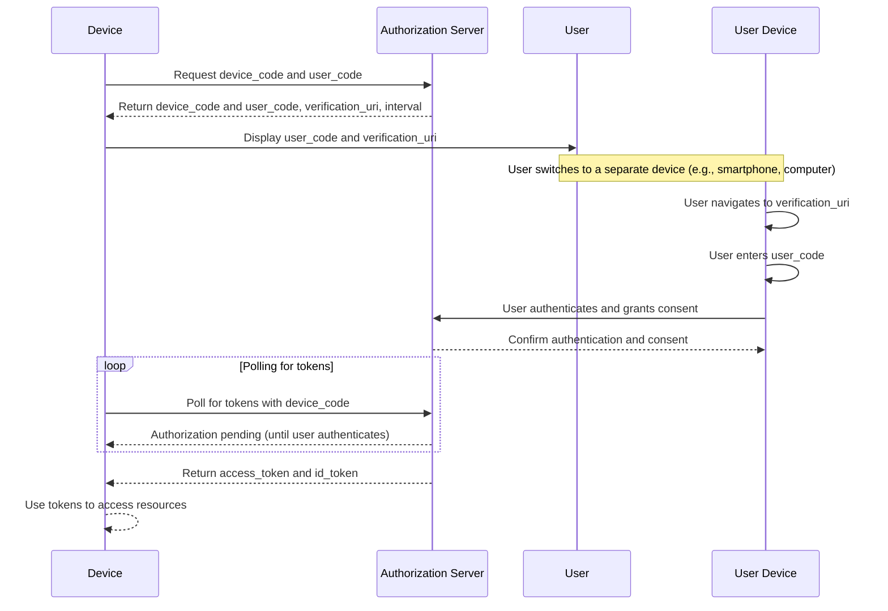

# Device Code Flow Summary:
- User Code and Device Code: The device receives a user code and device code from the authorization server.
- Separate Device Authentication: The user authenticates and grants consent on a separate device with a browser.
- Polling Mechanism: The device polls the authorization server until tokens are issued.
- Ideal for: Devices with limited input capabilities or no browser, allowing secure user authentication and authorization.

---
# Device Code Flow Visualization
This diagram illustrates the steps involved in the Device Code Flow, highlighting the interactions between the device, the authorization server, and the user (on a separate device).

