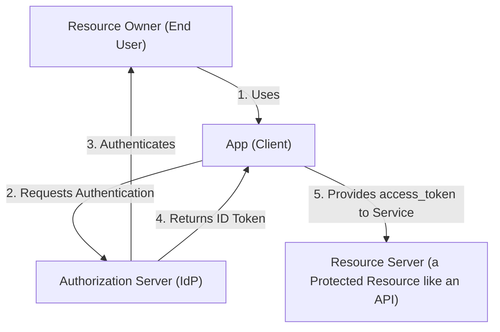

# Open ID Connect
Open ID Connect aka **OIDC** is an extension of OAuth 2.0 to provide **authentication**, as OAuth was only meant to be used for **authorization**.

There are a few different components that are necessary to understand if you are interested in knowing how it works and what is happening at a lower level as they interact with each other.

## Roles
There are four essential parties involved in the authentication & authorization flows:
1. Resource owner (End user)
2. Client (The App the user is trying to use)
3. Authorization Server (Identity Provider aka IdP)
4. Resource Server (The API/Resource we are attempting to access)

#### The diagram shows a high level view of how OIDC works:

## Tokens
There are three types of tokens: `id_token`, `access_token`, and `refresh_token`.
- See `JWT/JWT.md` for more information.

## OpenID configuration document
In OpenID Connect (OIDC) you have this idea of a Discovery endpoint with information related to the other endpoints required for authentication. For more details about this you can reference the [OpenID Connect Discovery 1.0 incorporating errata set 2](https://openid.net/specs/openid-connect-discovery-1_0.html) specification. 

This endpoint is called the **`OpenID Connect metadata document`** and the most common consumers of this data is the App's authentication libraries/code.

To find the location of this endpoint in Azure, within the portal go to Identity -> Applications -> App registrations -> `<Your Application>` and click Endpoints in the Overview page. You will find a list of all the endpoints related to your application including the `OpenID Connect metadata document`. If you go to this endpoint you'll find a JSON object with all the different fields.

You can test getting the OpenID configuration using the `OIDC.ipynb` notebook.