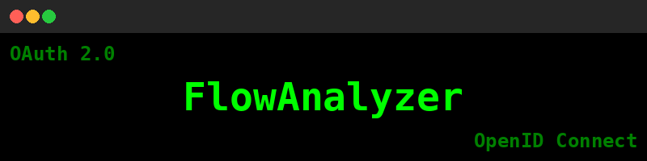

## Flow Analyzer
**Flow Analyzer** is designed for helping in low level understanding and testing of OAuth 2.0 Grants/Flows.

Although my use cases are from the security side of things, it can be beneficial from an engineer's point of view as well 😊     
- You'll find the notebooks to execute the flows under the `/Flows` directory and a brief explanation of each flow in `/Flows/Flows.md`.
    - The flows themselves are separated in their corresponding directory, in my attempt to keep things tidy!
- If you are interested in playing around with certificate authentication, check out the `/Cert_Setup` directory for details on how to do it and set it up.
  
### Setup:
To get started please see `SETUP.md` as for a tiny bit of setup to get everything working 😊.
    
> [!WARNING] ⚠ The code here is not meant to be used to do any formal AuthN or AuthZ checks in **Production** applications. These are meant for **testing** ONLY! Believe me there are a lot of things that can go wrong here!
> Please use the [Microsoft identity platform authentication libraries](https://learn.microsoft.com/en-us/entra/identity-platform/reference-v2-libraries) for production code.  
> You can also take a look at [Libraries for Token Signing/Verification @ JWT.io](https://jwt.io/libraries)

---     
### OpenID Connect (OIDC)
OAuth 2.0 was designed for authorization. OpenID Connect (OIDC) extends the OAuth 2.0 functionality to provide authentication. To find out more about OIDC, check the `/OpenID_Connect-OIDC` directory.

---     
### JSON Web Tokens aka JWT(s) 
If we are talking about OAuth and modern authentication we can't skip talking about JWTs, as these are the type of tokens we will be working with.
For further insights, please see `/JWT/JWT.md`.
